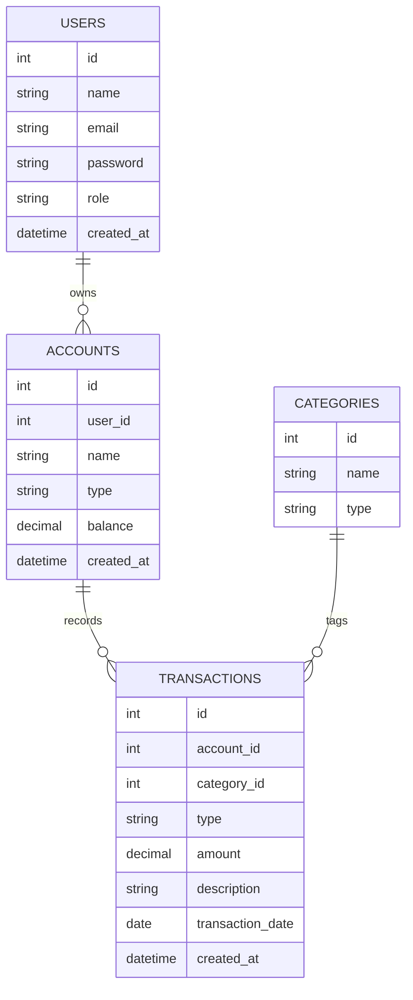

# FinTrack API

FinTrack is a personal finance backend for tracking users, their accounts, categorized transactions, and running balances. The schema is centered on four tables: users own accounts, accounts hold transactions, and transactions are tagged with categories so spending and income can be analyzed consistently.

## ERD



Export the diagram above to `docs/erd.png` before final submission.

## Setup

```bash
npm install
```

Copy `.env.example` to `.env`, then set `DATABASE_URL` to your local or hosted PostgreSQL connection string.

## Database

Run the raw SQL files against PostgreSQL when you need the hand-written schema and sample data:

```bash
psql "$DATABASE_URL" -f db/schema.sql
psql "$DATABASE_URL" -f db/seed.sql
psql "$DATABASE_URL" -f db/queries.sql
```

If you are using Prisma for Week 21, generate and seed the Prisma schema with:

```bash
npx prisma migrate dev
npm run db:seed
```

## Run Locally

```bash
npm run start:dev
```

## Project Notes

The app currently exposes `users`, `accounts`, `categories`, and `transactions` modules. The accounts module also includes a nested relational endpoint at `GET /accounts/:id/transactions`.

Add your deployed base URL here once the app is live.
