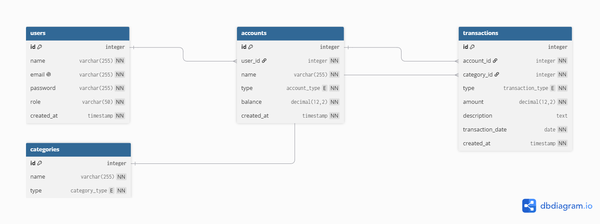

# FinTrack API

FinTrack is a personal finance backend for tracking users, accounts, transactions, categories, and balances. The data model is built around four tables: users own accounts, accounts store transactions, and transactions are tagged with categories so income and spending can be tracked clearly.

## ERD



## Setup

```bash
npm install
```

Copy `.env.example` to `.env`, then set `DATABASE_URL` to your local or hosted PostgreSQL connection string.

## Database

Run the raw SQL files against PostgreSQL when you need the SQL schema, seed data, or query examples:

```bash
psql "$DATABASE_URL" -f db/schema.sql
psql "$DATABASE_URL" -f db/seed.sql
psql "$DATABASE_URL" -f db/queries.sql
```

If you want to use Prisma, generate and seed the Prisma schema with:

```bash
npx prisma migrate dev
npm run db:seed
```

## Run Locally

```bash
npm run start:dev
```

## Project Notes

The app exposes `users`, `accounts`, `categories`, and `transactions` modules. The accounts module also includes `GET /accounts/:id/transactions` for nested transaction data.

Live URL: https://milestone-4-sayiki.onrender.com
